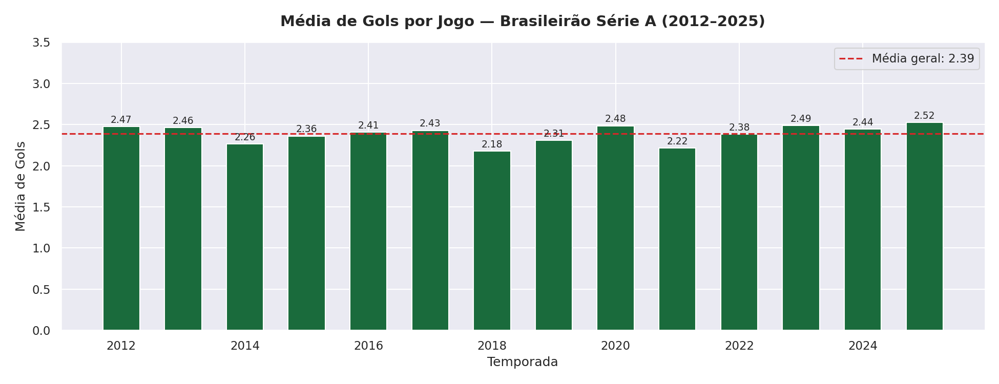
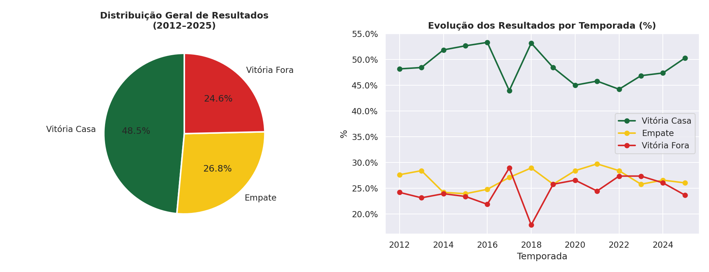
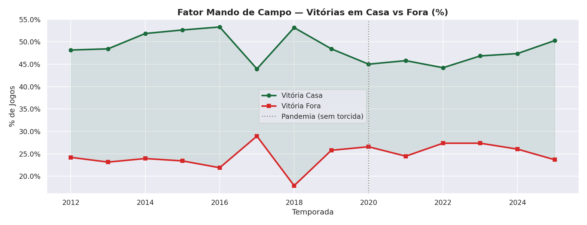
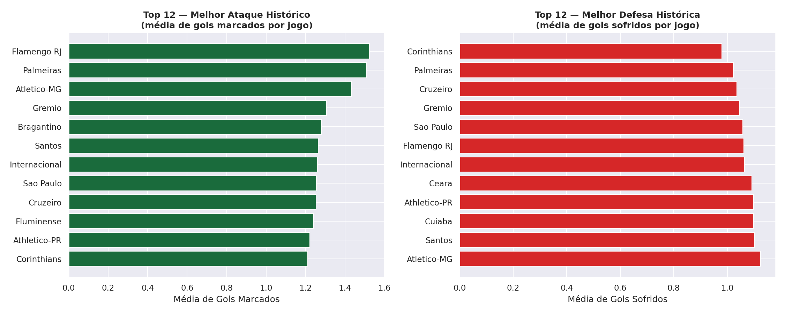
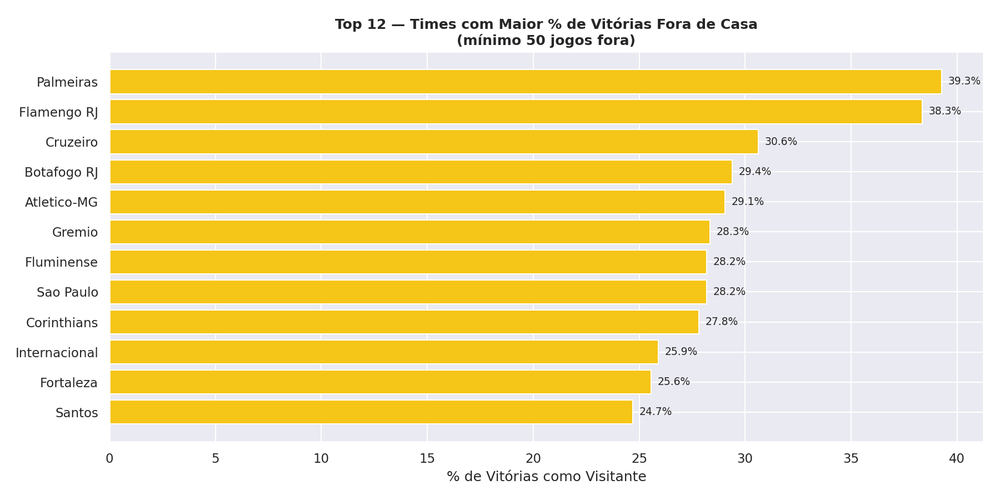
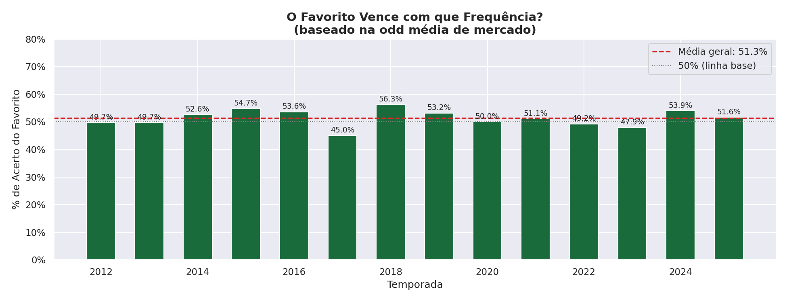
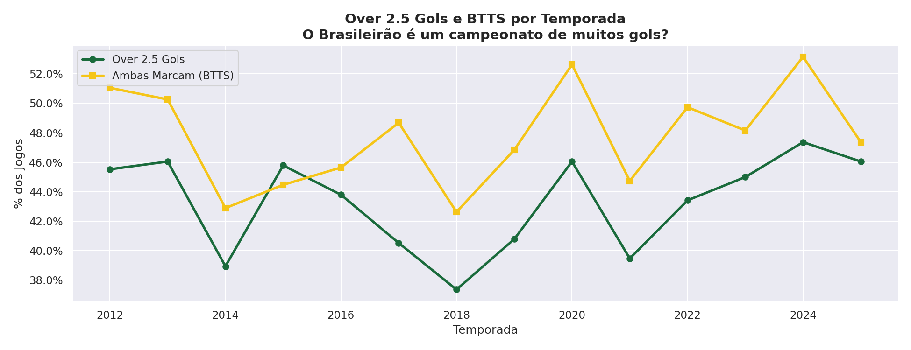
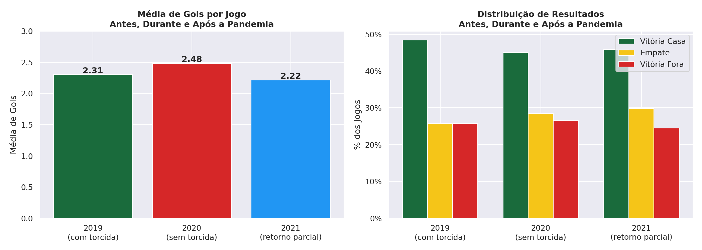
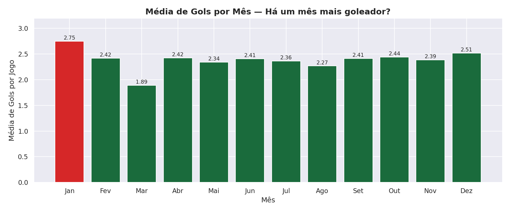

# 🇧🇷 14 Anos de Brasileirão: O que os dados revelam?
### Análise Exploratória de Dados — Campeonato Brasileiro Série A (2012–2025)


---

## 📌 Sobre o Projeto

Este projeto analisa **5.320 jogos** do Campeonato Brasileiro Série A ao longo de **14 temporadas completas (2012–2025)**, explorando padrões de gols, desempenho histórico dos clubes e o que o mercado de apostas revela sobre o futebol brasileiro.

A base de dados contém resultados, placares e odds de múltiplas casas de apostas (Pinnacle, Betfair, Bet365 e médias de mercado), permitindo cruzar análise esportiva com inteligência de mercado — uma abordagem pouco comum em portfólios de dados.

---

## 🎯 Objetivos

- Identificar tendências de gols e resultados ao longo de 14 temporadas
- Avaliar a força do fator mando de campo no futebol brasileiro
- Comparar o desempenho histórico dos grandes clubes
- Mensurar a precisão do mercado de apostas em prever resultados
- Investigar o impacto da pandemia (2020) no comportamento dos jogos

---

## 🗂️ Estrutura do Projeto

```
📁 brasileirao-eda/
├── 📁 data/
│   └── brasileirao_2012_2025.csv      # Base histórica de jogos
├── 📁 notebooks/
│   └── brasileirao_eda.ipynb          # Notebook principal
├── 📁 images/                         # Gráficos gerados
│   ├── 01_media_gols_temporada.png
│   ├── 02_distribuicao_resultados.png
│   ├── 03_mando_campo.png
│   ├── 04_ranking_ataque_defesa.png
│   ├── 05_vitorias_fora.png
│   ├── 06_favorito_venceu.png
│   ├── 07_over25_btts.png
│   ├── 08_pandemia.png
│   └── 09_gols_por_mes.png
├── .gitignore
└── README.md
```

---

## 🔧 Tecnologias Utilizadas

| Ferramenta | Uso |
|-----------|-----|
| Python 3.11 | Linguagem principal |
| Pandas | Manipulação e análise de dados |
| Matplotlib | Visualização de dados |
| Seaborn | Estilização dos gráficos |
| Jupyter Notebook | Ambiente de desenvolvimento |
| SQL Server | Fonte dos dados históricos |

---

## 📊 Análises Realizadas

### Bloco 1 — Panorama Geral

#### 🔵 Média de Gols por Temporada


O Brasileirão mantém uma média histórica estável de **2.39 gols por jogo**. A temporada de 2018 registrou a menor média (2.18), enquanto 2025 está no caminho de ser a mais goleadora (2.52).

---

#### 🔵 Distribuição de Resultados


Em 14 temporadas:
- **48.5%** dos jogos terminaram em vitória do time da casa
- **26.8%** em empate
- **24.6%** em vitória do visitante

O mando de campo é um fator real e consistente no futebol brasileiro.

---

#### 🔵 Fator Mando de Campo


A vantagem em casa se manteve ao longo de toda a série histórica. O ponto mais interessante ocorre em **2020**, quando jogos sem torcida reduziram a vantagem do mandante — evidência direta do impacto da presença da torcida no resultado.

---

### Bloco 2 — Os Grandes Clubes

#### 🟢 Ranking Histórico de Ataque e Defesa


- **Flamengo RJ** lidera o ranking de melhor ataque histórico (1.53 gols/jogo)
- **Palmeiras** é o segundo melhor ataque e também aparece entre as melhores defesas
- **Corinthians** registra a melhor defesa histórica do período (média de gols sofridos mais baixa)

---

#### 🟢 Times que Mais Vencem Fora de Casa


**Palmeiras (39.3%)** e **Flamengo RJ (38.3%)** são os únicos times a vencer fora de casa em mais de 35% das vezes — distância significativa em relação aos demais, refletindo o domínio dessas equipes na era moderna do Brasileirão.

---

### Bloco 3 — Odds vs Realidade

#### 📈 O Favorito Vence com que Frequência?


O time apontado como favorito pelo mercado vence em média apenas **51.3%** dos jogos — pouco acima do acaso. Isso reforça a imprevisibilidade do futebol e explica por que apostas simples em favoritos raramente são lucrativas no longo prazo.

---

#### 📈 Over 2.5 Gols e BTTS


- **Over 2.5 gols** ocorre em menos de **47%** dos jogos — o Brasileirão **não** é um campeonato de muitos gols
- **BTTS (Ambas Marcam)** oscila entre 42% e 53%, com leve crescimento nas temporadas recentes
- O mercado de apostas precifica Over 2.5 como evento raro, e os dados confirmam essa percepção

---

### Bloco 4 — Curiosidades

#### 🔎 A Pandemia Mudou o Futebol?


A temporada de 2020, disputada sem torcida, revelou dados curiosos:
- Média de gols **aumentou** para 2.48 (vs 2.31 em 2019)
- Vitórias fora de casa subiram — o chamado "fator torcida" foi claramente evidenciado
- Com o retorno parcial da torcida em 2021, os números voltaram ao padrão histórico

---

#### 🔎 Existe um Mês Mais Goleador?


**Janeiro** apresenta a maior média de gols (2.75), mas com amostra menor por ser mês de poucos jogos. **Março** registra a menor média (1.89), coincidindo com o início das temporadas quando equipes ainda buscam ritmo. Os demais meses são bastante homogêneos.

---

## 💡 Principais Conclusões

| Insight | Dado |
|--------|------|
| Média histórica de gols | **2.39 gols/jogo** |
| % de vitórias em casa | **48.5%** |
| % de vitórias fora | **24.6%** |
| Acerto do favorito pelo mercado | **51.3%** |
| Over 2.5 por temporada | **~43%** |
| Melhor ataque histórico | **Flamengo RJ** |
| Melhor defesa histórica | **Corinthians** |
| Maior % de vitórias fora | **Palmeiras (39.3%)** |

---

## 🚀 Próximos Passos

Este projeto faz parte de uma série de análises sobre o Brasileirão:

- [ ] **Semana 2** — Integração com API-Football para estatísticas avançadas (xG, chutes, posse)
- [ ] **Semana 3** — Análise de jogadores via FBref
- [ ] **Semana 4** — Mercado de transferências com Transfermarkt
- [ ] **Semana 5** — Dashboard interativo em Streamlit

---

## ▶️ Como Executar

```bash
# Clone o repositório
git clone https://github.com/seu-usuario/brasileirao-eda.git

# Instale as dependências
pip install pandas matplotlib seaborn jupyter

# Abra o notebook
jupyter notebook notebooks/brasileirao_eda.ipynb
```

---

## 👤 Autor

**Roney Wesley Galan**
Cientista de Dados | Analista de BI

[](https://linkedin.com/in/roney-wesley-galan-ba7aa194)
[](https://github.com/seu-usuario)

---

> *"Sem dados, você é apenas mais uma pessoa com uma opinião."* — W. Edwards Deming
